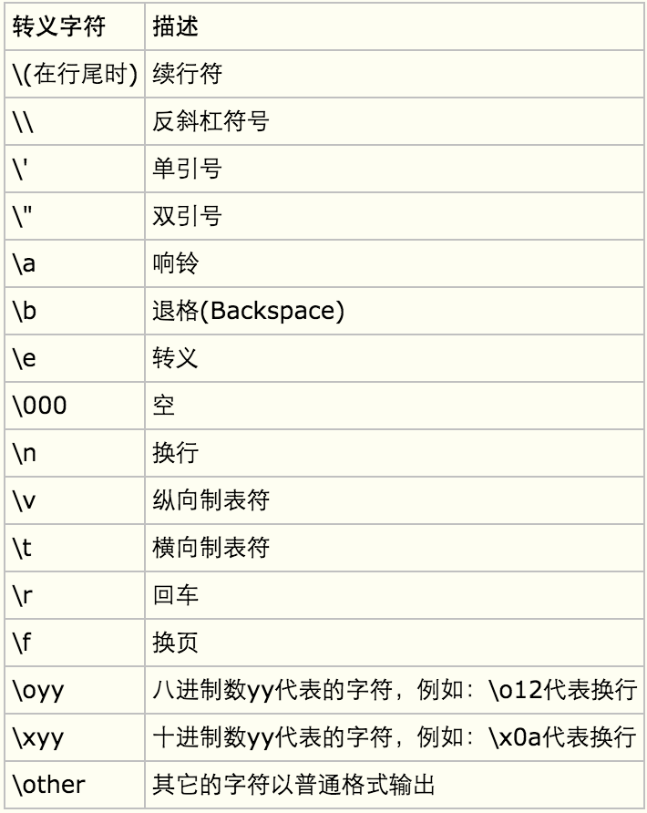

# 笨方法

### 习题0

命令行内输入python运行Python.

Ctrl+D退出Python.

###习题1

进入了Python即是进入了交互式的Python程序内. 直接通过命令行输入python **.py则是直接运行制作好的用Python语言编写的程序. 

如果进入了Python里面输入python **.py则不会正常运行程序, 会显示"SyntaxError: invalid syntax".

Python里面, print语句中双引号跟单引号的作用是一样的.

关键! : 

使用utf-8编程可以避免因为编码问题而显示乱码的情况. 

解决方法:

在Python脚本的最上面加入下面这一行: 

    # -*- coding: utf-8 -*-

先保存**.py文件, 之后编辑器的文字就会因应代码显示出不同颜色的文字. 

###习题2

在编码行的起始位置放置#, 代表对代码进行注释, 实际运行时会忽略该行. 可以用这种方式临时禁用一段代码.而处于引号内部的#属于字符串的一部分, 不代表注释的意思. 

    #英文叫octothorpe, 或者pound/hash/mesh等. 
    
###习题3

Python中的数学计算优先顺序为:括号(Parentheses), 指数(Exponents), 乘(Multiplication), 除(Division), 加(Addition), 减(Subtraction)

%的用法: 求余数. X%Y=J, J X除以Y余J, 计算结果J.

python中整数除以整数得出整数, 整数后加入小数位, 得出结果为两个小数位的结果. 

程序输入

    print 算式
程序输出
    
    结果
    
##习题4
生成变量: 

    cars = 100
    
=的名字是等于, 它的作用是为东西取名. 当变量为数值时, 无需在前后加入引号. 

##习题5

变量可以为字符串, 字符串中也可以包含变流量. 

    x = 'There are %d types of prople.' % 10
    #变量可以为字符串, 也可以在字符串中直接赋值.
    print "Let`s talk about %s." % my_name
    #在字符串中体现变量
    print "He`s got %s eyes and %s hair.' % (my_eyes, my hair)
    #在字符串中体现多于一个变量
    print 'If I add %d, %d, and %d I get %d.' % (my_age, my_height, my_weight, my_age + my_height + my_weight)
    #在字符串中体现变量计算

变量名要以字母开头.

遇到TypeError: 'str' object is not callable.表示漏写了字符串和变量之间的%.

将浮点数四舍五入可以使用round()函数, 如round(1.7333).

####**Python格式化字符**

(Python String Format)参考:http://www.douban.com/note/269665597/
Google:https://www.google.com/webhp?sourceid=chrome-instant&ion=1&espv=2&ie=UTF-8#q=python%20%E6%A0%BC%E5%BC%8F%E5%8C%96%E5%AD%97%E7%AC%A6

    %%	百分号标记 #就是输出一个%
    %c	字符及其ASCII码
    %s	字符串
    %d	有符号整数(十进制)
    %u	无符号整数(十进制)
    %o	无符号整数(八进制)
    %x	无符号整数(十六进制)
    %X	无符号整数(十六进制大写字符)
    %e	浮点数字(科学计数法)
    %E	浮点数字(科学计数法，用E代替e)
    %f	浮点数字(用小数点符号)
    %g	浮点数字(根据值的大小采用%e或%f)
    %G	浮点数字(类似于%g)
    %p	指针(用十六进制打印值的内存地址)
    %n	存储输出字符的数量放进参数列表的下一个变量中

%r用来做调试比较好, 它会显示变量的原始数据(raw data), 而%s和其他的符号则是用来向用户显示输出的.

##习题6

可以在print后再给字符串赋值
    
    hilarious = False
    joke_evaluation = "Isn`t that joke so funny?! %r"
    
    print joke_evaluation % hilarious
    
可以连续print, 此处w和e为变量.

    w = "This is the left side of..."
    e = "a string with a right side."

    print w + e
    
字符串中%的数量要与后面的变量数相对应.

习题7

    print 'Its fleece was white as %s.' % 'snow'
在字符串中输入字符串.___*变量名是不会带引号的.*___

    print '.' * 10
输出10个'.'
    
    end1 = 'C'
    end2 = 'h'
    end3 = 'e'
    end4 = 'e'
    end5 = 's'
    end6 = 'e'
    end7 = 'B'
    end8 = 'u'
    end9 = 'r'
    end10 = 'g'
    end11 = 'e'
    end12 = 'r'

    #watch that comma at the end. try removing it to see what happens
    print end1 + end2 + end3 + end4 + end5 + end6,
    print end7 + end8 + end9 + end10 + end11 + end12
删除end6后面的逗号时, 输出分开两行的两个单词

Python代码不建议一行超过80个字符.

##习题8

    formatter = '%r %r %r %r'
    print formatter % (formatter, formatter, formatter, formatter)
    
字符串中可以全部为变量. 字符串输出可以引用字符串本身?所用用%r?(%r可以获取某些东西的调试信息)

数字与特定字符在Python中有特定功能, 如果在前后加了引号就成了字符串,无法实现它们本来的功能.
%r打印出来的中文(或者其他非ASCII的字符是乱码, 可以使用%s打印.

    print formatter % (
	    "I had this thing.",
	    "That you could type up right.",
	    "But it didn`t sing.",
	    "So I said goodnight."
    )
可以输出为连续的语句

###习题9

字符串以\n开始就可以在新的一行显示. (new line)

使用前后呼应的连续三个", 即"""xxxxx""", 既可以让字符串扩展到任意多行, 且可以直接转行, 不用输入\n. 

###习题10

\ , 反斜杠这个自居一般用于字符串里面的一些字符""转义", 是字符串具有不被一般规则解读的功能. 比如在字符串中输出引号, 斜杠, tab缩进等等. 

参考笨方法P33.

    while True:
	    for i in ['1', '2', '3', '4', '5]: 
		    print '%s\r' % i,
以上代码运行时可以在同一字符格内循环显示1,2,3,4,5

    persian_cat = 'I`m split\non a line. '
    print '%r' % persian_cat
    print '%s' % persian_cat
    print persian_cat
以上代码输出为

'I`m split\non a line. '

I`m split 

on a line.

I`m split

on a line.

由此可以看出格式化字符的区别, 还有转义序列与其的结合效果.

###习题11

print后的代码最后加个逗号, 可以使输出时光标不跳转到下一行.

**input 后加入(), 则会在命令行界面里面出现输入情景.

    print 'How old are you?',
    age = input()
    print 'How tall are you?',
    height = raw_input()
以上代码可以区别input与raw_input的区别, 第一条问题可以输入算式. 第二条问题是直接输出你输入了什么.

**当输入为纯数字时**

input返回的是数值类型，如int(整数), float(浮点数)

raw_inpout返回的是字符串类型，string类型

###习题12

习题11中的效果, 可以通过在raw_input后面的括号中输入说明内容实现, 然后用户输入的结果会赋值给等号前面的变量. 详见书本说明.

引号要前后对应相同, 不能前面用单引号, 后面用双引号. 

python提供了pydoc命令，它提供在线帮助以及生成程序说明。pydoc是Python自带的模块，主要用于从python模块中自动生成文档，这些文档可以基于文本呈现的、也可以生成WEB 页面的，还可以在服务器上以浏览器的方式呈现！用法:

    pydoc raw_input
    
一般只有命令语言才会有解说. 

###习题13

脚本=代码=程序

参数=argument

Python的模块(或者叫做'库')需要开头用from ... import ..的语句调用.

Argv = argument variable, 及所谓'参数变量', 这个变量保存着你运行Python脚本时传递给Python脚本的参数, 相当于一个容器.

####习题13

    from sys import argv

    script, first, second, third = argv

    print 'The script is called:', script
    print 'Your first variable is:', first
    print 'Your second variable is:', second
    print 'Your third variable is:', third
本习题的示范代码如上, 在命令行中运行时,注意! 输入python ex13.py后面要追加三个命令行参数(可以 不同参数, 如: python ex13.py first 2nd 3rd )才能实现应该看到的结果.

上述命令中, 第二行为"解包", 即将收集到的参数依次赋值给左边的这些变量. 

命令行中运行python ex13.py, 里面ex13.py部分就是所谓的参数. 

argv与raw_input()的不同在于argv是在用户执行命令时就要输入, 如果在脚本运行过程中需要用户输入的, 就是raw_input().

